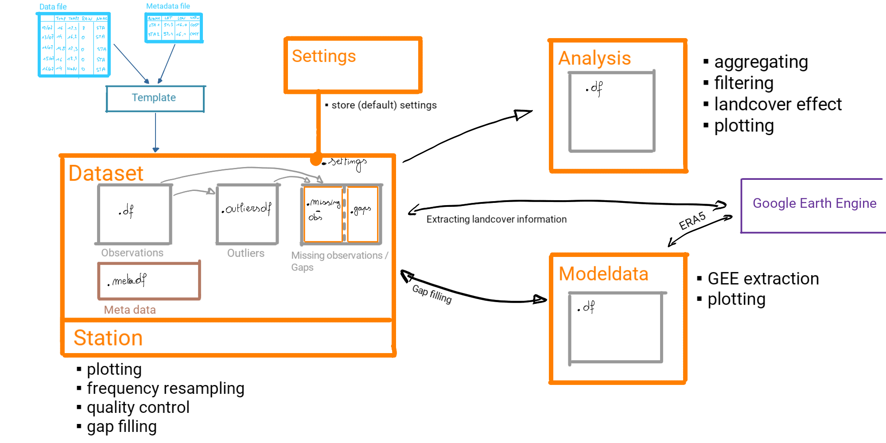

*******************
Introduction
*******************

This package is designed for handling meteorological observations for urban or non-traditional networks. It includes tools to clean up and analyze your data.

How to install
=======================

To use the package python 3.9 or higher is required.
To install the package one can use pip:

.. code-block:: console

   pip install metobs-toolkit

To install the PyPi version of the toolkit. To install the github versions one can use these commands:

.. code-block:: console

   #main versions
   pip install git+https://github.com/vergauwenthomas/MetObs_toolkit.git

   #development version
   pip install git+https://github.com/vergauwenthomas/MetObs_toolkit.git@dev

   #specific release from github
   pip install git+https://github.com/vergauwenthomas/MetObs_toolkit.git@v0.2.0

For some advanced quality control methods, the `Titanlib <https://github.com/metno/titanlib>`_ package is used.
Since the installation of titanlib requires a c++ compiler, it is categorized as a *extra-dependency*. This means that
the user must install titanlib manually if this functionality is required or use the following command:

.. code-block:: console

   pip install metobs-toolkit[titanlib]

.. note::
   To install the package in a notebook, one has to add ! in front of the pip install command.

and import it in Python

.. code-block:: python

   import metobs_toolkit

   #Check your version
   metobs_toolkit.__version__

How to use this toolkit
=========================

This toolkit is a Python package based on object-oriented programming (OOP). Here you can find a short description of the classes that are directly used by the users:

Dataset()
-----------

The :ref:`Dataset <Dataset api>` class is at the heart of the toolkit and it holds all observations and metadata.

.. code-block:: python

   your_dataset = metobs_toolkit.Dataset()

The dataset class has attributes that serve as 'containers' to hold data:

Dataset.df
    All(*) records will start in the *df-container*. This container contains the observations that we assume to be correct.

    (*): One exception is the observations with a duplicated timestamp, these will be passed to the outliersdf-container directly.

Dataset.outliersdf
    When applying quality control, some observations may be labeled as outliers. When an observation is labeled as an outlier, it is added to the *outliersdf-container*.
    The records labeled as outliers are still kept inside the df-container but the observation value is removed (set to Nan).

Dataset.gaps
    When the data is imported, the toolkit will look for missing gaps in your data. This is done by
    assuming a perfect time frequency of your data. A `Gap` is created if data is missing. All the gaps are combined
    in a list and stored at `Dataset.gaps`.

Dataset.metadf
    When metadata is provided, it will be stored in the Dataset.metadf. The metadf is stored as tabular data where each row represents a station. When variables are computed that depend only
    on a station (No time evolution and independent of the observation type), it is stored here. All land cover information and observation frequency estimations are stored here.

.. note::

   A **record** refers to a unique combination of timestamp, corresponding station, and observation type.

Station()
-----------

A :ref:`Station <Station api>` is a class that has the same attributes and methods as a Dataset, but all the observations are limited to a specific station.

.. code-block:: python

   your_station = your_dataset.get_station(stationname = 'station_A')

Analysis()
-----------
The :ref:`Analysis <Analysis api>` class is created from a Dataset and holds the observations that are assumed to be correct (the df-container of the Dataset). In contrast to the Dataset, the Analysis methods do not change the observations.
The Analysis methods are based on aggregating the observations to get insight into diurnal/seasonal patterns and landcover effects.

.. code-block:: python

   your_dataset_analysis = your_dataset.analysis()

.. note::

   Creating an Analysis of a Station is not recommended, since there is not much scientific value in it.

GEE Modeldata classes
----------------------

Two classes are designed to interact with a GEE (Google Earth Engine) dataset:

* `GeeStaticModelData`: This class handles GEE Datasets that do not have a time dimension (static). This class is used to extract GEE dataset values at the location of the station (or buffers arround them).
* `GeeDynamicModelData`: This class handles GEE Dataset that have a time dimension. This class is used to extract timeseries of GEE dataset values at the stations locations.

Both classes can hold metadata (=Coordinates of the stations), and the `GeeDynamicModelData` class can hold timeseries data.
These classes are used for extracting extra metadata (landcover, altitude, soil properties, ...) and for comparing
observations with modelled data (plotting, filling gaps, ...).

There are default modeldata classes prepared, and they are stored in the `Dataset.gee_datasets`.

.. code-block:: python

   ERA5_timeseries = your_dataset.get_modeldata(
                                       Model=your_datast.gee_datasets['ERA5-land'],
                                        obstype='temp')

See the API documentiontion :ref:`Geemodeldata <Geemodeldata api>` for more details.

The toolkit makes use of the Google Earth Engine (GEE), to extract these time-series. To use the GEE API, follow these steps on :ref:`Using Google Earth Engine<Using_gee>`.

Settings()
-----------
Each Dataset holds its own set of :py:meth:`Settings<metobs_toolkit.settings.Settings>`. When creating a Dataset instance, the default settings are attached to it. When another class is created (i.g. Station, Modeldata, ...) from a Dataset, the corresponding settings are inherited.
There are methods to change some of the default settings (like quality control settings, timezone settings, gap fill settings, ...). To list all the settings of a class one can use the :py:meth:`show<metobs_toolkit.settings.Settings.show>` method on it:

.. code-block:: python

   #Create a Dataset, the default settings are attached to it
   your_dataset = metobs_toolkit.Dataset()

   #Update the timezone from 'UTC' (default) to Brussels local time
   your_dataset.update_timezone(timezonestr='Europe/Brussels')

   #create a Station instance from your dataset
   your_station = your_dataset.get_station(stationname = 'station_A')

   #Since the settings are inherited, your_stations has also the timezone set to Brussels local time.

   # print out all settings
   your_dataset.settings.show()
   your_station.settings.show()

Schematic overview
====================

